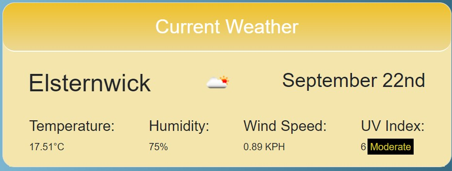

# Weather Dashboard

## Description

A Weather dashboard that displays the current weather and gives you a 5 day forecast. This was created for users to be able to see the weather today and the future. The motivation for this was to practice my skills and learn how to use server APIs

## Table of Contents

- [Installation](#installation)
- [Usage](#usage)
- [Credits](#credits)
- [License](#license)

## Installation

To use and open the app, follow this link: https://breakfireaus.github.io/weather-dashboard/

## Technology Used

- Web api
- bootstrap
- Jquery
- Webapi
- Javascript
- HTML
- Server Side api
- Moment

## Usage and Features
- Main Page

- Search with Cities

- Search History with clear button

    

- Current and Forecast weather Shows up

- Current Weather Pop up

- UV index Changes Color according to green for Low, Yellow for Moderate and Red for High

    

- 5 Day forecast Pop up

## Credits

- Ask BCS team @ Monash university Bootcamp
- Tutor
- W3 Schools
- Jquery documentation
- MDN web docs
- https://openweathermap.org/api
- Traversy Media
- Moment

## License

MIT License

Copyright (c) 2022 breakfireaus

Permission is hereby granted, free of charge, to any person obtaining a copy
of this software and associated documentation files (the "Software"), to deal
in the Software without restriction, including without limitation the rights
to use, copy, modify, merge, publish, distribute, sublicense, and/or sell
copies of the Software, and to permit persons to whom the Software is
furnished to do so, subject to the following conditions:

The above copyright notice and this permission notice shall be included in all
copies or substantial portions of the Software.

THE SOFTWARE IS PROVIDED "AS IS", WITHOUT WARRANTY OF ANY KIND, EXPRESS OR
IMPLIED, INCLUDING BUT NOT LIMITED TO THE WARRANTIES OF MERCHANTABILITY,
FITNESS FOR A PARTICULAR PURPOSE AND NONINFRINGEMENT. IN NO EVENT SHALL THE
AUTHORS OR COPYRIGHT HOLDERS BE LIABLE FOR ANY CLAIM, DAMAGES OR OTHER
LIABILITY, WHETHER IN AN ACTION OF CONTRACT, TORT OR OTHERWISE, ARISING FROM,
OUT OF OR IN CONNECTION WITH THE SOFTWARE OR THE USE OR OTHER DEALINGS IN THE
SOFTWARE.

